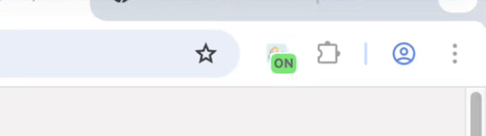
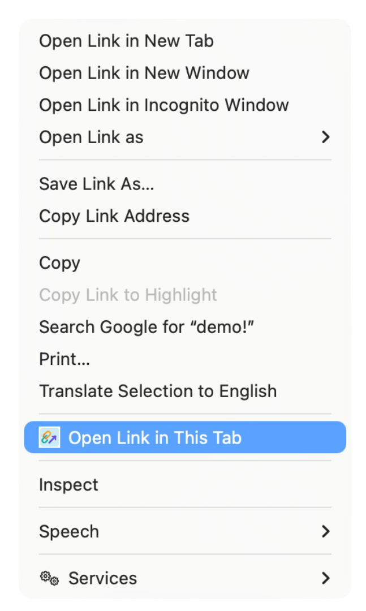

# Force Links to New Tab (Toggle)
A lightweight Chromium extension (Chrome, Edge, Opera, etc.) that forces normal left-clicks on links to open in a new tab instead of the current one.
Useful if you always want to keep your current page in place while exploring links.

## Features / Usage

- **Force new tab:** Every left-click on a link opens in a new tab (unless ignored or whitelisted).
- **Toggle ON/OFF:** Click the toolbar icon or use the shortcut `Alt+Shift+W` / `Opt+Shift+W` to enable/disable.
- **Context menu:** Right-click a link → `Open Link in This Tab`.
- **Whitelist:** Exclude specific domains from being forced into new tabs.
- **Background tabs:** Optionally open new tabs without switching focus.
- **YouTube exception:** Option to ignore links with timestamp (`t`) or playlist (`list`) parameters.
- **Keyboard override:** Hold `` ` `` (backtick) to to bypass the extension for a single click.
- **Toast notification** Small toast message confirms when a link is opened (can be disabled).

## Installation

1. [Download](https://github.com/snghnaveen/force-new-tab/archive/refs/heads/main.zip) or clone this repository.
2. Go to your browser's extensions page (works for Chromium-based browsers):
    - Chrome: [chrome://extensions](chrome://extensions)
    - Opera: [opera://extensions](opera://extensions)
    - Edge: [edge://extensions](edge://extensions)
3. Enable `Developer mode`.
4. Click `Load unpacked` and select this folder.

### Screens
- 

- 
---
- 
---
- 

## License

MIT

## Author

[Naveen Singh](https://github.com/snghnaveen)