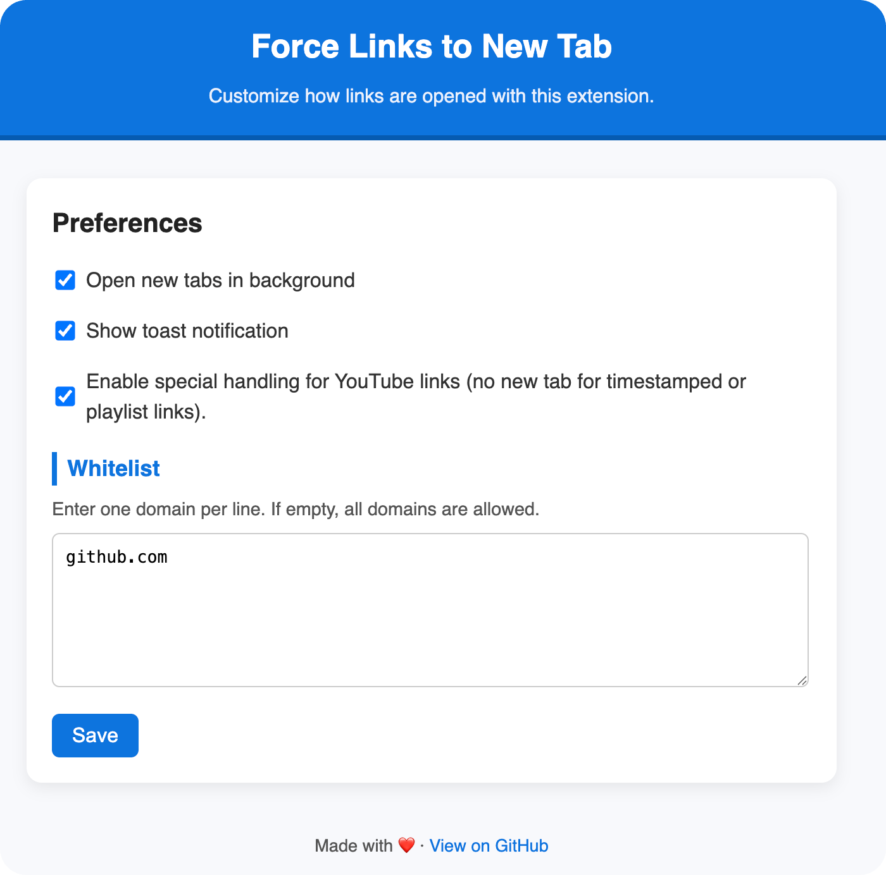

# Force Links to New Tab (Toggle)
A Chromium-based browser extension (Chrome, Edge, Opera, etc.) that forces all normal left-clicks on links to open in a new tab.

## Features / Usage

- **Force new tab:** All left-clicks on links open in a new tab (unless whitelisted or ignored).
- **Toggle ON/OFF:** Use the toolbar icon or `Alt+Shift+W` / `Opt+Shift+W` to enable/disable.
- **Whitelist:** Ingore specified domains (leave empty to force all).
- **Open in background:** Optionally open new tabs in the background.
- **YouTube exception:** Links with `t` (timed) or `list` (playlist) parameters are ignored.
- **Keyboard override:** Hold `Q` to temporarily disable the extension for a click.

## Installation

1. [Download](https://github.com/snghnaveen/force-new-tab/archive/refs/heads/main.zip) or clone this repository.
2. Go to your browser's extensions page (works for Chromium-based browsers):
    - Chrome: [chrome://extensions](chrome://extensions)
    - Opera: [opera://extensions](opera://extensions)
    - Edge: [edge://extensions](edge://extensions)
3. Enable `Developer mode`.
4. Click `Load unpacked` and select this folder.

## Options

- **Open in background:** Checkbox to open new tabs without switching focus.
- **Whitelist:** Enter one domain per line. If empty, all domains are affected.

### Screenshots

- 
---
- 
---
- 
---

## License

MIT

## Author

[Naveen Singh](https://github.com/snghnaveen)